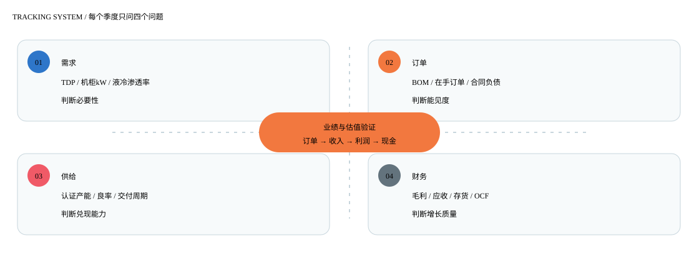
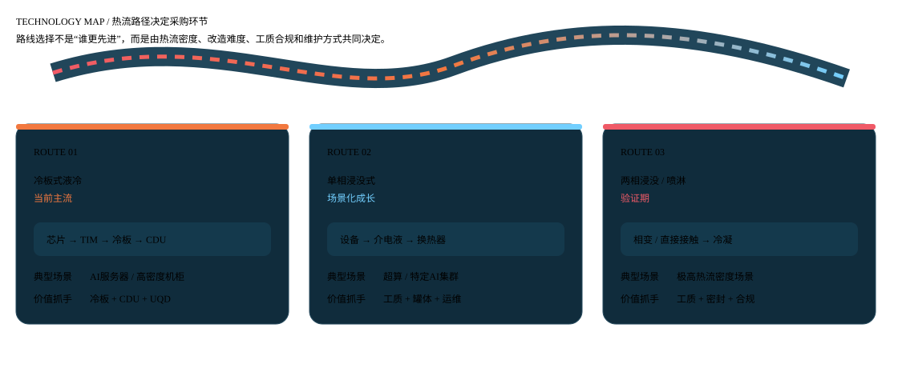
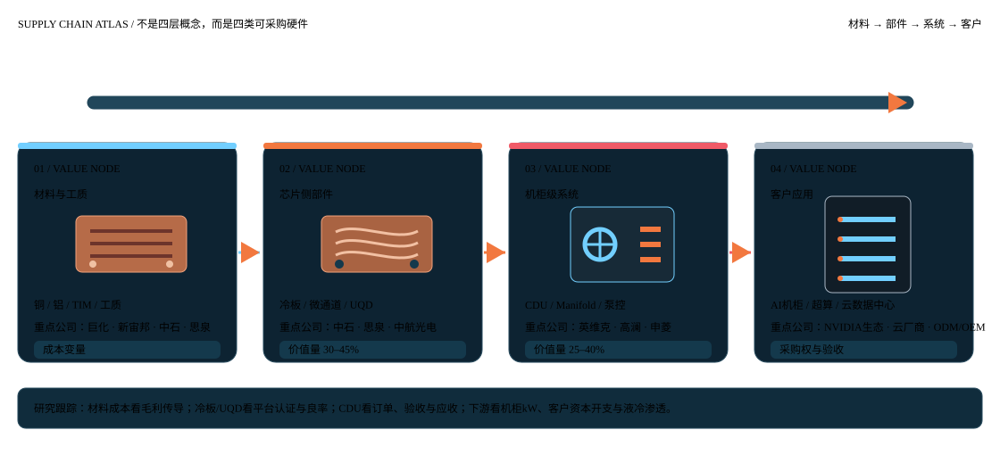
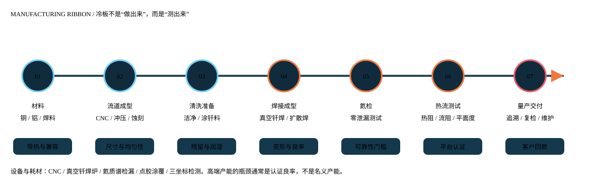
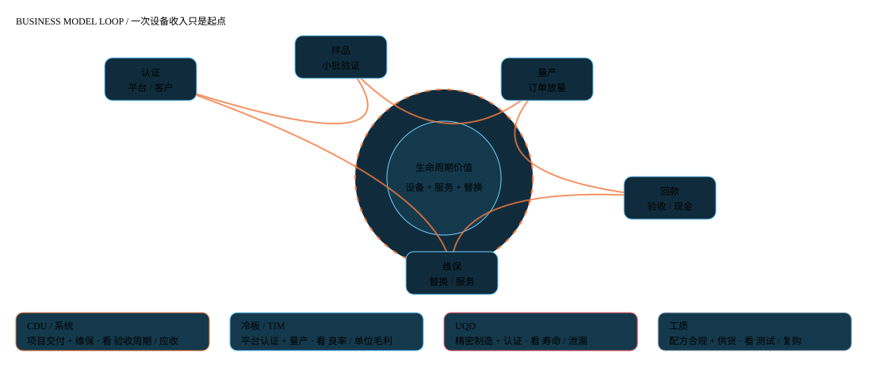

# 液冷行业研究框架 v3

> **数据截止：2026年7月21日｜基准版本：2026年6月30日｜覆盖：A股产业链 + 海外技术与客户对标**  
> 本文是行业研究框架与公开资料整理，仅供研究使用，不构成投资建议。市场规模、渗透率、价值量和国产化率均需结合来源、时间与口径阅读。

## 先给结论：优先关注CDU，其次是NV定制冷板/TIM，UQD与高端工质作为卡位观察

液冷行业的核心投资逻辑不是“数据中心用了液冷，所以所有相关公司都受益”，而是：**AI芯片功耗提升，改变散热方式；散热方式改变，重新分配服务器机柜内外的采购权和价值量；采购权变化，再决定哪类公司能够获得订单、认证和利润。**

### 结论矩阵

| 结论层级 | 优先环节 | 重点公司 | 关注理由 | 当前最重要的验证 |
| --- | --- | --- | --- | --- |
| 核心配置环节 | CDU及液冷基础设施 | 英维克、高澜股份、申菱环境 | 系统中枢、订单前置、工程与认证壁垒较高；解耦交付有利于基础设施供应商独立获得订单 | 在手订单能否转化为出货、验收、回款；毛利率是否稳定 |
| 高弹性环节 | NV定制冷板、微通道冷板、TIM | 中石科技、思泉新材、银轮股份 | 与GPU/CPU平台直接绑定，单芯片功耗和冷板数量提升可能带来单位价值量增长 | 新平台量产认证、液冷收入占比、良率、客户集中度 |
| 卡位观察环节 | UQD/连接器与高端流体接口 | 中航光电、飞龙股份、川环科技、溯联股份 | 失效代价高，认证与可靠性壁垒高，国产替代空间较大 | OCP/客户认证、批量出货、泄漏率和寿命测试 |
| 上游材料卡位 | 高端工质与氟精细化学品 | 巨化股份、新宙邦 | 3M电子氟化液退出和PFAS合规背景带来替代窗口 | 客户测试、合规文件、吨级产能、稳定复购 |
| 路线差异化观察 | 浸没式液冷 | 曙光数创 | 在超算和特定数据中心场景具备技术积累，但商业模式更项目化 | 项目验收、回款、服务收入与标准化产品占比 |

### 投资研究建议

1. **研究优先级**：先研究CDU和NV定制冷板，再研究UQD、TIM和工质，最后扩展到管路、泵、密封和其他跨界标的。
2. **公司优先级**：英维克看“系统能力 + 海外客户 + 订单兑现”；中石科技看“平台认证 + 冷板/TIM收入”；高澜和申菱看“收入弹性是否能转化为利润和现金流”；中航光电、飞龙、巨化、新宙邦看“卡位能否量产”。
3. **估值纪律**：高成长叙事不能替代盈利和现金流验证。当前部分标的的PE-TTM/PB已隐含较高增长，必须用季度收入、毛利率、经营现金流和客户认证更新判断。
4. **时间窗口**：2026H2—2027年是高功耗平台和液冷基础设施集中验证期，但“窗口”不等于“所有公司业绩同时兑现”。

### 催化剂、验证条件与失效条件

| 类型 | 事件/条件 | 对产业链的影响 | 验证方式 |
| --- | --- | --- | --- |
| 平台催化 | NVIDIA Rubin及后续平台量产 | 提高芯片与机柜的散热要求，推动冷板、CDU、UQD和TIM升级 | NVIDIA/OCP资料、服务器ODM BOM、公司量产公告；来源：`official-nvidia-rubin-2026` |
| 客户催化 | 海外云厂商、国内互联网客户液冷基础设施招标 | CDU及一次侧基础设施采购前置，提升订单能见度 | 订单金额、交付批次、客户结构、回款；来源：`local-dongwu-2026-06` |
| 国产替代催化 | UQD标准与客户认证落地 | 连接器从样品/小批量进入平台化供应 | OCP标准、寿命测试、客户认证与出货套数；来源：`official-ocp-uqd-2025` |
| 材料催化 | 3M电子氟化液退出后的替代 | 提高国产高端工质验证价值 | 客户测试、合规、产能和复购；来源：`official-3m-pfas-exit-2025` |
| 业绩验证 | 2026H2—2027收入、毛利与现金流同步改善 | 证明行业景气不是订单或估值单变量 | 定期报告、iFinD、应收/存货和经营现金流 |
| 失效条件 | 功率密度提升不及预期、液冷订单延后、认证无法量产 | 估值和业绩预期同时下修 | 机柜功率、订单、出货、平台BOM、客户集中度 |

---

## 1、行业投资逻辑

### 本节结论

液冷是由**算力功耗与机柜密度**驱动的基础设施升级，而不是单纯的节能设备替换。行业处于商业化加速期，投资机会集中在能够进入客户标准、解决高密度散热问题并形成稳定交付的公司。

### 1.1 四层逻辑链

| 层级 | 核心问题 | 研究判断 | 关键指标 |
| --- | --- | --- | --- |
| 物理约束 | 芯片热量是否超过风冷经济性边界 | 高功耗GPU/CPU和高密度机柜使液冷必要性提升 | 单芯片TDP、机柜kW、PUE、温差 |
| 采购变化 | 谁掌握液冷部件的采购权 | 服务器内冷板/UQD与机房侧CDU可能分别由不同主体采购 | CSP/ODM采购模式、平台BOM、招标边界 |
| 价值重分配 | 哪些环节拥有较高价值量和毛利 | CDU、冷板和高可靠接口价值集中，但各项目边界差异大 | 单柜价值量、毛利率、单位毛利、良率 |
| 业绩兑现 | 订单是否转化为利润和现金 | 认证、扩产、交付和回款决定估值能否兑现 | 收入增速、订单、应收、存货、OCF |

### 1.2 行业阶段判断

TrendForce披露的公开行业数据称，AI数据中心液冷采用率由2024年的14%提升至2025年的33%，并将GB200/GB300 NVL72单柜功率密度列为重要驱动因素（`trendforce-liquid-cooling-2025-08`）。这一数据属于特定样本和定义，不应直接等同于全球所有数据中心的液冷渗透率。

从产业生命周期看，行业已完成技术可行性验证，正在进入规模化导入与供应链重构阶段。此阶段最重要的不是继续证明“液冷有效”，而是判断：

- 哪些平台把液冷写入交付标准；
- 哪些客户从试点转向批量部署；
- 哪些供应商从展示样机进入稳定量产；
- 哪些公司可以在扩产后保持毛利率和现金流。

### 1.3 选股筛选器

建议按“必要性、认证、规模、盈利、估值”五项进行公司筛选：

| 维度 | 高质量信号 | 负面信号 |
| --- | --- | --- |
| 必要性 | 产品位于高功耗平台的必选或强约束环节 | 仅为概念展示或可被普通风冷替代 |
| 认证 | 有客户/平台认证，且进入量产BOM | 只有送样、实验室数据或“合作意向” |
| 规模 | 产线、良率和交付能力可复制 | 项目依赖单一工程团队，扩产慢 |
| 盈利 | 产品结构改善带来毛利与单位毛利提升 | 收入增长但毛利率、现金流恶化 |
| 估值 | 业绩增速能够覆盖估值要求 | PE/PB已隐含过高增长，缺乏安全边际 |

---

## 2、跟踪体系

### 本节结论

跟踪液冷不能只看“液冷概念指数”或公司公告中的订单金额，应建立从**需求—平台—订单—产能—出货—财务—估值**的闭环。每月跟踪景气信号，每季跟踪财务兑现，每次平台迭代更新价值量。

### 2.1 需求与平台指标

| 观察层 | 具体指标 | 数据来源 | 研究意义 |
| --- | --- | --- | --- |
| 芯片 | GPU/CPU TDP、冷板数量、热流密度 | NVIDIA产品资料、服务器技术白皮书 | 判断液冷的物理必要性和冷板升级方向 |
| 机柜 | kW/机柜、液冷占比、CDU配置 | OCP、客户招标、机构报告 | 判断液冷系统价值量和交付边界 |
| 数据中心 | 新建机房、改造项目、PUE、供电与水资源约束 | 客户资本开支、IDC/赛迪、政策文件 | 判断新增需求与存量改造 |
| 采购 | 一次侧/二次侧、服务器内/机房侧采购主体 | 招标文件、ODM/OEM公告 | 判断供应商议价权与订单前置期 |

### 2.2 公司和财务指标

| 维度 | 跟踪指标 | 绿灯条件 | 黄灯/红灯条件 |
| --- | --- | --- | --- |
| 订单 | 在手订单、合同负债、预收、交付排产 | 订单增速高于收入，且交付节奏明确 | 订单口径宽泛，长期未转收入 |
| 收入 | 液冷分部收入、单柜/单片出货 | 液冷收入增速高于公司整体 | 依赖一次性项目或业务占比无法确认 |
| 利润 | 毛利率、单位毛利、期间费用率 | 产品结构升级带动毛利率稳定或改善 | 低价抢单、扩产导致毛利下滑 |
| 现金 | OCF/净利润、应收周转、存货周转 | OCF与利润同步，周转稳定 | 应收、存货显著快于收入增长 |
| 产能 | CDU台数、冷板片数、认证产能、良率 | 高端产线投产且良率爬坡 | 名义产能扩张但客户认证不足 |
| 客户 | 客户集中度、海外收入、前五客户变化 | 客户从单一项目扩展到多客户 | 单一客户依赖、客户回款恶化 |
| 估值 | PE-TTM、PB、PS、业绩预期 | 业绩兑现速度高于估值收缩速度 | 高估值与低现金流并存 |

### 2.3 建议的跟踪频率

- **月度**：平台发布、客户招标、公司订单、铜/铝/泵/板换/密封与工质价格、产线招聘与设备进场。
- **季度**：收入、毛利率、应收、存货、经营现金流、合同负债、资本开支、客户和区域结构。
- **年度**：平台认证复盘、产能利用率、产品路线变化、客户集中度、研发资本化和商誉/并购风险。
- **事件驱动**：NVIDIA/OCP标准、客户量产、UQD认证、工质合规、重大订单、产能投放和重大资本运作。

---

## 3、基础原理与技术路线

### 本节结论

液冷的本质是用液体替代或部分替代空气，把芯片产生的热量更高效地传递到冷却回路，再通过CDU、板换或室外散热系统排出。冷板式当前成熟度和部署便利性较高；浸没式在特定场景具有高密度和低PUE优势；喷淋式仍属于小范围探索。

### 3.1 用热流路径理解系统

可以把液冷系统拆成四个热管理动作：

1. **接热**：TIM填充芯片盖板和冷板之间的微观间隙。
2. **带热**：冷却液在冷板微流道中流动，将芯片热量带走。
3. **换热**：CDU通过板式换热器把IT侧热量传递给设施侧水路。
4. **排热与控制**：泵、传感器、阀、Manifold和监控系统维持流量、压力、温度与漏液安全。

NVIDIA对GB200 NVL72的公开资料显示，该平台包含72颗GPU，并采用直接液冷；NVIDIA技术博客同时提到其参考架构可提供约120kW冷却能力（`official-nvidia-gb200-2025`）。这类平台资料能说明技术事实，但不能直接推导所有厂商的收入份额。

### 3.2 三类路线对比

| 路线 | 接触方式 | 适用场景 | 优点 | 局限 | 当前判断 |
| --- | --- | --- | --- | --- | --- |
| 冷板式 | 冷却液不直接接触芯片，流经冷板 | AI服务器、通用高密度机柜 | 兼容现有服务器形态，维护和迁移相对容易 | 冷板、管路和接口增加系统复杂度 | 当前主流，优先研究 |
| 单相浸没式 | 设备浸入不沸腾介电液体 | 超算、特定AI集群 | 散热均匀、噪声低、机柜密度高 | 改造深、工质成本与材料兼容要求高 | 场景化成长，关注项目和服务 |
| 两相浸没式 | 介电液体相变吸热后冷凝 | 极高热流密度和特殊场景 | 相变潜热大、可实现高密度 | 工质、密封、环保合规和维护复杂 | 需要跟踪工质与客户验证 |
| 喷淋式 | 液体直接喷淋发热部件 | 小批量或特定设备 | 局部散热能力强 | 可靠性、维护和标准化难度高 | 非主流观察路线 |

### 3.3 关键技术指标

| 指标 | 含义 | 影响环节 |
| --- | --- | --- |
| 热阻 | 芯片到冷却液的温差与热流比值 | TIM、冷板流道、接触平面度 |
| 压降 | 流体通过系统的压力损失 | 泵功耗、流道设计、Manifold、UQD |
| 流量均匀性 | 多颗芯片获得的冷却液分配一致性 | CDU、Manifold、阀控、冷板设计 |
| 漏液/渗漏 | 液路完整性与失效概率 | UQD、密封、焊接、检漏工艺 |
| PUE | 数据中心总能耗与IT设备能耗比 | 冷却方式、风机、泵、换热器和环境 |
| 维护性 | 更换部件、盲插、排液和恢复时间 | UQD、模块化CDU、监控系统 |

---

## 4、市场规模情况

### 本节结论

液冷市场规模仍处于高增长阶段，但公开资料存在明显口径差异。本报告采用“机构区间 + 行业数据点”的方式，不把不同口径简单相加。中性研究假设可将中国市场理解为：2026年约200—300亿元、2030年约700—1000亿元的研究区间；该区间来自不同机构预测，不是统一统计口径。

### 4.1 公开数据与机构预测

| 市场 | 2024/2025 | 2026E | 2030E | CAGR/变化 | 来源与口径 |
| --- | ---: | ---: | ---: | --- | --- |
| AI数据中心液冷采用率 | 14% / 33% | — | — | 2024—2025快速提升 | TrendForce特定样本；`trendforce-liquid-cooling-2025-08` |
| 中国液冷市场 | 约163亿元（单一机构估算） | 约232—274亿元 | 约700—1000亿元 | 机构预测差异较大 | `local-guosheng-2026-06`、`local-huayuan-2026-06`、`market-iim-china-2030-2026` |
| 全球液冷市场 | — | — | 约422亿美元 | 机构估算 | `local-guosheng-2026-06` |

### 4.2 自上而下拆解

液冷市场可以用以下公式研究：

> **市场规模 = 液冷机柜数量 × 单柜液冷价值量 + 存量改造/维保/工质服务收入**

其中，液冷机柜数量取决于AI服务器资本开支、机柜功率密度、液冷渗透率和机房改造比例；单柜价值量取决于平台、GPU数量、冷板数量、CDU容量、是否含一次侧系统和服务边界。

### 4.3 三种情景

| 情景 | 需求假设 | 价值量假设 | 结果特征 |
| --- | --- | --- | --- |
| 乐观 | 高功耗平台快速量产，云厂商液冷采购前置 | 微通道冷板、CDU和UQD升级，单柜价值量提升 | 设备收入和估值同时扩张 |
| 中性 | 新建AI机房液冷渗透率提升，存量改造渐进 | CDU与冷板增长，标准件竞争加剧 | 收入高增长但利润分化 |
| 悲观 | 平台延迟、局部风冷继续使用或客户资本开支波动 | 低毛利标准化产品占比提高 | 订单推迟、应收和库存压力上升 |

### 4.4 市场规模研究的三个陷阱

1. **把液冷设备市场和液冷全产业链市场相加**：CDU、冷板、管路、工质和服务可能重复计入。
2. **把新建机房渗透率当作全市场渗透率**：AI新建机柜的液冷率通常高于传统存量机房。
3. **把单柜价值量直接乘以全球机柜数**：必须核对服务器内冷板、CDU、一次侧系统和工程服务是否均包含在价值量中。

---

## 5、产业链全景分析

### 本节结论

产业链可分为“材料与基础零件—核心热交换与流体接口—液冷系统集成—数据中心与设备应用”四层。价值量相对集中在冷板和CDU，但利润和议价权不完全等同于价值量：UQD价值占比不高，却可能因可靠性和认证形成较高单件溢价；系统集成价值量较高，却可能受项目制和回款影响。

### 5.1 产业链分层

| 层级 | 主要构成 | 代表公司/对标 | 研究问题 |
| --- | --- | --- | --- |
| 上游材料 | 铜/铝材、钎料、TIM、密封件、泵、工质、传感器 | 金田、海亮、巨化、新宙邦、思泉、中石；海外3M历史对标 | 材料是否可替代、是否通过平台认证、成本如何传导 |
| 中游部件 | 冷板、微通道冷板、CDU、Manifold、UQD、管路、换热器 | 英维克、高澜、申菱、中石、中航光电、飞龙、川环、溯联 | 谁拥有客户认证、良率和批量交付能力 |
| 系统集成 | 机柜级液冷、一次侧/二次侧系统、监控与运维 | 英维克、曙光数创、申菱、高澜、Vertiv、Schneider | 是否具备标准化平台和服务收入 |
| 下游客户 | 云厂商、互联网、运营商、AI服务器ODM/OEM、超算中心 | NVIDIA生态、谷歌、Meta、微软、阿里、腾讯、字节、三大运营商 | 采购权在哪里，招标和平台BOM如何变化 |

### 5.2 价值量与利润的区别

机构研究常见的单柜拆分通常将冷板和CDU列为价值量较高的环节，但具体比例受平台和系统边界影响。本报告采用以下研究区间：冷板约30%—45%，CDU及基础设施约25%—40%，其余由UQD、管路、泵、Manifold、工质、监控和服务构成（`local-guosheng-2026-06`、`local-guangfa-2026-05`）。

这并不意味着冷板和CDU必然拥有最高净利润。应进一步拆解：

- **产品毛利率**：是否有平台定制、认证和技术溢价；
- **费用率**：项目交付和海外认证是否增加销售、研发、服务费用；
- **周转效率**：客户付款条件、在途库存和验收周期；
- **资产回报率**：产线和设备投资能否被高利用率覆盖。

### 5.3 采购权变化：解耦交付

传统服务器系统可能由整机厂或机房集成商整体交付；高密度液冷时代，客户可能分别采购服务器内冷板/UQD、机柜侧CDU和设施侧系统。解耦交付的意义在于：

1. CDU和一次侧系统的订单可能早于服务器批量到货；
2. 服务器厂商、GPU平台方和云厂商对关键部件的认证权提升；
3. 系统厂商既要满足工程交付，也要适应客户指定BOM；
4. 供应商的客户关系从“项目中标”转向“平台认证 + 长周期供货”。

---

## 6、上游原材料与卡脖子环节

### 本节结论

上游最值得研究的不是单纯“材料价格上涨”，而是材料是否能够满足**热物性、可靠性、环保合规与平台认证**。当前可把卡位难度按“高端UQD/连接器、微通道冷板与TIM、高端工质、密封材料”排序；铜铝等通用材料重要，但更偏成本变量而非长期卡脖子。

### 6.1 铜、铝与钎料

冷板、管路、Manifold和换热器均涉及铜或铝。研究重点包括：

- 导热率、加工性、耐腐蚀与冷却液兼容性；
- 铜/铝价格和加工费对冷板单位成本的影响；
- 真空钎焊、扩散焊和机加工路线对材料规格的要求；
- 客户是否允许材料替换，替换是否触发重新认证。

**投资含义**：铜价上涨对冷板、管路和连接器的成本压力更直接。若公司拥有调价机制、材料集中采购和高端产品溢价，成本上涨可能部分传导；若产品标准化程度高且客户议价能力强，则毛利率更容易承压。

### 6.2 氟化液与介电工质

3M已宣布在2025年底前退出PFAS制造，并逐步停止Novec、Fluorinert等相关特种流体产品（`official-3m-pfas-exit-2025`、`official-3m-specialty-fluids`）。这为国产氟精细化学品厂商提供替代窗口，但“退出”不等于国产厂商可以立即获得稳定订单，客户仍需验证：

- 介电性能、沸点、黏度、热导率和挥发性；
- 与铜、铝、焊料、橡胶、塑料和涂层的长期兼容性；
- PFAS法规、回收、泄漏和全生命周期成本；
- 小样测试、设备测试、客户试点到批量复购的转换。

巨化股份和新宙邦可以作为上游材料卡位公司观察，但目前不宜直接把公司整体含氟业务收入等同液冷工质收入。

### 6.3 TIM：最后一毫米

TIM填充芯片盖板和冷板之间的微观空隙，影响总热阻和长期可靠性。重点指标包括导热率、热阻、泵出、干涸、压缩回弹、界面稳定性和平台认证。

中石科技和思泉新材属于材料/冷板侧的重点观察标的，研究时应将“实验室导热率”与“批量产品热阻、良率、认证和收入”分开。单一宣传参数不能替代量产证据。

### 6.4 高端密封与连接器材料

UQD和管路的关键不是是否能“通水”，而是在高频插拔、振动、温度循环和长期运行后仍保持低泄漏、低压降和快速维护。OCP UQD标准文件对流体损失、耐久和测试方法提出了明确要求（`official-ocp-uqd-2025`、`official-ocp-uqd-methodology`）。

因此，UQD的卡位指标应优先看认证与可靠性，而不是仅看材料或单件价格：

| 指标 | 研究问题 |
| --- | --- |
| 盲插/快速连接 | 是否满足机柜维护场景，插拔力和误操作边界如何 |
| 流体损失 | 每次连接/断开后的液体损失是否满足标准 |
| 寿命 | 是否完成数千次级别的耐久测试，测试介质是什么 |
| 压降 | 对泵功耗和整个液路的影响是否可接受 |
| 兼容性 | 与冷却液、密封和不同金属材料是否长期兼容 |

---

## 7、中游制造工艺、设备与耗材

### 本节结论

中游制造的核心能力是“把热设计变成可量产、可检验、可维护的产品”。冷板看流道、焊接、平面度和良率；CDU看板换、泵控、传感器和系统集成；UQD看精密加工、密封、寿命和泄漏；TIM看配方、涂覆和认证。产能扩张必须和认证、良率、回款一起看。

### 7.1 冷板制造流程与关键设备

常见冷板制造环节包括：材料下料与成型、流道加工、表面清洗、钎料/焊接准备、真空钎焊或扩散焊、焊后处理、氦质谱检漏、平面度与尺寸检测、表面处理和最终可靠性测试。

对应设备/耗材包括：

- CNC、五轴加工中心、冲压/蚀刻/挤压设备；
- 真空钎焊炉、扩散焊设备和焊料；
- 清洗、烘干、表面处理设备；
- 氦质谱检漏、流阻测试、热阻测试和三坐标检测；
- TIM涂覆、点胶、固化、洁净包装与追溯系统。

### 7.2 工艺路线对比

| 路线 | 优势 | 短板 | 更适合的产品 |
| --- | --- | --- | --- |
| 真空钎焊 | 工艺成熟，适合复杂流道与批量制造 | 焊接良率、变形、清洁度与检漏要求高 | 主流冷板 |
| 机加工/铣削 | 流道可控，开发周期短 | 材料利用率与加工成本较高 | 小批量、复杂定制 |
| 冲压/蚀刻/复合 | 可提高规模化效率 | 模具、材料和焊接一致性要求高 | 标准化批量冷板 |
| 扩散焊 | 结合强度和微通道能力较强 | 设备投入、洁净度和工艺窗口要求高 | 高端微通道冷板 |
| 增材制造 | 结构设计自由度高 | 成本、效率、材料和可靠性仍需验证 | 研发与特殊结构 |

### 7.3 CDU制造与系统集成

CDU可拆解为板式换热器、泵、过滤器、膨胀/补液模块、阀组、温压流传感器、控制器、机箱结构和监控接口。竞争力来自：

1. **热设计**：换热容量和温差控制；
2. **流体控制**：流量、压力和多支路均匀分配；
3. **安全控制**：漏液、过温、过压和故障切换；
4. **工程交付**：不同机房一次侧水路、供电和空间约束适配；
5. **服务能力**：备件、远程监控、维保和故障响应。

### 7.4 设备与耗材的投资判断

设备公司通常处在产业链更上游，订单可能早于产线投产，但也可能受到客户资本开支波动影响。研究时要看：

- 设备订单是单次扩产还是持续换代；
- 客户是否拥有多家设备供应商；
- 设备验证周期、交付周期和售后服务；
- 设备收入确认与客户验收是否匹配；
- 核心耗材是否形成复购和高毛利。

---

## 8、下游应用领域

### 本节结论

AI数据中心是液冷最强主线，储能和新能源汽车热管理是成熟度较高的相邻市场，工业激光、通信和超算提供补充需求。不同下游的采购、认证、产品形态和盈利模式差异很大，不应使用同一套估值倍数。

### 8.1 AI数据中心

AI下游需要关注：GPU/CPU平台、机柜功率、集群规模、机房水路、客户自研芯片和服务器ODM。GB200 NVL72和Vera Rubin NVL72等公开平台资料显示，NVIDIA正在持续推进高密度液冷机柜架构（`official-nvidia-gb200-product`、`official-nvidia-rubin-2026`）。

投资上优先关注三类订单：

- 服务器内的冷板、TIM和UQD；
- 机柜侧CDU、Manifold、泵和管路；
- 数据中心设施侧换热、监控、运维和改造。

### 8.2 储能与新能源

储能液冷的核心变量是电芯能量密度、循环寿命、安全性、系统成本和运维。其产品更偏标准化集成，客户通常重视可靠性、批量交付和全生命周期成本。英维克、高澜、同飞等公司在温控与储能场景拥有交叉能力。

需要区分：储能液冷的订单和收入可以证明公司具有液冷制造能力，但不能直接证明其已进入AI服务器液冷的高端客户BOM。

### 8.3 新能源汽车与工业设备

新能源汽车的电池、电机、电控和热泵系统提供成熟的换热器、管路、泵和密封工艺迁移机会。飞龙股份、川环科技、溯联股份、银轮股份等可作为跨赛道观察对象，但AI数据中心的材料、洁净度、泄漏标准和客户认证仍可能更严格。

工业激光、通信设备、超算和高端电源的液冷需求通常更加分散，研究重点是订单可持续性、客户集中度和服务收入。

---

## 9、行业竞争格局分析

### 本节结论

竞争格局呈现“海外系统平台、台系核心制造、大陆系统与零部件追赶”的多层结构。大陆厂商在CDU、机柜级系统和部分材料/连接器领域具备切入机会，但冷板、UQD和平台级认证仍需持续验证。

### 9.1 竞争维度

| 竞争维度 | 系统集成商 | 冷板/TIM供应商 | UQD供应商 | 工质供应商 |
| --- | --- | --- | --- | --- |
| 认证对象 | 客户机房、平台架构、项目 | GPU/CPU平台、ODM、服务器 | 平台标准、客户可靠性 | 设备、材料兼容与环保合规 |
| 交付周期 | 项目制，前置期较长 | 认证后批量供货 | 认证周期长、批量稳定性要求高 | 配方验证和产能爬坡 |
| 护城河 | 方案、服务、客户关系 | 流道/材料/良率 | 精密加工、密封、标准 | 配方、合规、规模和稳定供货 |
| 主要财务风险 | 应收、项目验收、库存 | 良率、材料成本、客户集中 | 认证投入和小批量 | 化工周期、资本开支和环保 |

### 9.2 国内公司定位

| 公司 | 主要位置 | 核心看点 | 研究分类 |
| --- | --- | --- | --- |
| 英维克 | CDU、液冷系统、储能温控 | 产品矩阵、海外客户、订单和毛利 | 核心配置 |
| 高澜股份 | CDU、板换 | 收入弹性、订单质量和现金流 | 高弹性 |
| 申菱环境 | CDU、数据中心温控 | 客户拓展、订单交付、利润率 | 高弹性 |
| 曙光数创 | 浸没式系统 | 超算/AI项目、标准化和回款 | 路线观察 |
| 中石科技 | TIM、冷板 | 新平台认证、客户份额和单位价值量 | 高弹性 |
| 思泉新材 | 材料、冷板 | 纳米碳等路线的量产验证 | 高弹性 |
| 中航光电 | 连接器、UQD | 标准贡献、客户认证和高可靠制造 | 卡位观察 |
| 飞龙股份 | 精密流体件、UQD观察 | 汽车工艺迁移和服务器客户验证 | 卡位观察 |
| 巨化股份/新宙邦 | 氟精细化学品 | 工质认证、产能和复购 | 上游卡位 |

### 9.3 海外对标

- **Vertiv**：数据中心电源、热管理与服务平台，适合作为系统基础设施和全球客户网络对标。
- **Schneider Electric**：电源、数据中心基础设施和液冷生态布局，适合作为综合基础设施平台对标。
- **Modine**：热交换与热管理制造平台，液冷是其多元业务中的增长方向，适合作为制造与产品组合对标。
- **CoolIT Systems、AVC、台达、双鸿、健策**：在高密度液冷、冷板、CDU或服务器散热供应链中具有参考价值，但部分公司并非A股上市或财务披露口径不可直接比较。

### 9.4 行业集中度的正确读法

现阶段不宜仅依据未经审计的“市占率”判断龙头。应拆成：

1. 设计认证份额；
2. 量产出货份额；
3. 客户/区域覆盖；
4. 高端产品收入和毛利份额；
5. 售后与备件收入。

---

## 10、产业链上市公司全景与财务对比

### 本节结论

A股液冷公司财务表现差异大，原因既包括业务成熟度，也包括液冷收入在公司整体收入中的占比差异。中石科技的2025年毛利率和净利率在本组公司中较高，但液冷收入占比仍需拆分；英维克收入规模和成长性较突出，但毛利率下降与现金流需要持续跟踪；高澜、申菱、曙光数创的利润和现金流更容易受项目节奏影响。

### 10.1 公司全景

| 环节 | 核心公司 | 观察公司 | 业绩是否可直接代表液冷 |
| --- | --- | --- | --- |
| CDU/系统 | 英维克、高澜股份、申菱环境、曙光数创 | 同飞股份、冰轮环境 | 需看分部或公告拆分 |
| 冷板/TIM | 中石科技、思泉新材 | 银轮股份、三花智控 | 多为热管理整体口径 |
| UQD/连接器 | 中航光电、飞龙股份 | 川环科技、溯联股份 | 液冷业务仍需订单验证 |
| 工质 | 巨化股份、新宙邦 | 三美股份、永和股份 | 含氟业务整体口径，不能直接等同液冷 |

### 10.2 2023—2025财务对比

> 金额单位：人民币亿元；百分比为%；ROE为iFinD报告期口径；OCF为经营活动现金流净额；“资本开支代理”采用iFinD“购建固定资产、无形资产和其他长期资产支付的现金”，不是完整自由现金流。数据为公司整体口径，不能直接等同液冷业务。来源：`ifind-a-financials-2026-07-21`。

| 公司 | 年度 | 营收 | 归母净利 | 毛利率 | 净利率 | ROE | 研发率 | OCF | 资本开支代理 | 应收周转 |
| --- | ---: | ---: | ---: | ---: | ---: | ---: | ---: | ---: | ---: | ---: |
| 英维克 | 2023 | 35.29 | 3.74 | 21.02 | 9.88 | 16.23 | 7.45 | 4.53 | 2.04 | 2.21 |
| 英维克 | 2024 | 45.89 | 4.87 | 19.33 | 9.90 | 18.01 | 7.62 | 2.00 | 3.53 | 2.21 |
| 英维克 | 2025 | 60.68 | 4.99 | 17.51 | 8.94 | 15.69 | 7.35 | 1.57 | 3.03 | 2.21 |
| 高澜股份 | 2023 | 5.73 | *2.80 | — | — | — | — | 0.49 | 0.24 | 2.08 |
| 高澜股份 | 2024 | 6.91 | -0.45 | 22.10 | -7.18 | -3.23 | 6.54 | -0.68 | 0.53 | 2.19 |
| 高澜股份 | 2025 | 9.89 | 0.02 | 27.31 | 2.80 | 0.11 | 5.50 | 1.11 | 0.26 | 2.56 |
| 申菱环境 | 2023 | 25.11 | 1.79 | 27.41 | 4.15 | 8.85 | 6.15 | 0.14 | 2.22 | 2.10 |
| 申菱环境 | 2024 | 30.16 | 0.99 | 23.85 | 3.68 | 3.96 | 5.66 | 1.35 | 3.75 | 1.99 |
| 申菱环境 | 2025 | 42.09 | 1.23 | 22.91 | 5.35 | 4.67 | 4.57 | 3.25 | 3.75 | 2.14 |
| 中石科技 | 2023 | 12.58 | 0.74 | 25.11 | 5.72 | 4.07 | 6.33 | 1.90 | — | 3.48 |
| 中石科技 | 2024 | 15.66 | 2.01 | 30.95 | 12.80 | 10.25 | 5.39 | 2.40 | — | 3.90 |
| 中石科技 | 2025 | 18.35 | 3.39 | 36.26 | 18.40 | 16.06 | 5.55 | 2.80 | — | 3.46 |
| 思泉新材 | 2023 | 4.34 | 0.55 | 25.11 | 12.63 | 7.76 | 5.33 | 0.12 | — | 2.85 |
| 思泉新材 | 2024 | 6.56 | 0.52 | 24.81 | 7.38 | 5.16 | 5.52 | 0.04 | — | 2.82 |
| 思泉新材 | 2025 | 9.28 | 0.60 | 27.00 | 6.38 | 5.72 | 6.08 | 0.07 | — | 3.08 |
| 中航光电 | 2023 | 200.74 | 33.26 | 37.04 | 17.61 | 17.55 | 10.95 | 30.88 | 23.94 | 3.03 |
| 中航光电 | 2024 | 206.86 | 29.59 | 34.64 | 17.15 | 13.42 | 10.89 | 21.50 | 15.43 | 1.97 |
| 中航光电 | 2025 | 213.86 | 25.78 | 23.02 | 10.99 | 10.77 | 9.78 | 15.62 | 15.82 | 1.76 |
| 飞龙股份 | 2023 | 40.95 | 2.51 | 6.86 | 5.89 | 9.06 | 5.87 | 3.16 | 0.95 | 5.32 |
| 飞龙股份 | 2024 | 47.23 | 3.04 | 6.43 | 6.93 | 9.25 | 5.76 | 3.81 | 2.80 | 4.93 |
| 飞龙股份 | 2025 | 45.45 | 3.50 | 8.81 | 6.65 | 10.24 | 6.58 | 3.74 | 4.15 | 4.01 |
| 巨化股份 | 2023 | 206.55 | 9.44 | 13.22 | 4.69 | 5.98 | 4.84 | 21.96 | — | 21.73 |
| 巨化股份 | 2024 | 244.62 | 19.60 | 17.50 | 8.90 | 11.57 | 4.31 | 27.65 | — | 28.18 |
| 巨化股份 | 2025 | 269.91 | 37.83 | 28.23 | 16.02 | 19.79 | 4.15 | 62.61 | — | 30.68 |
| 新宙邦 | 2023 | 74.84 | 10.11 | 28.94 | 13.50 | 11.53 | 6.48 | 34.48 | — | 4.00 |
| 新宙邦 | 2024 | 78.47 | 9.42 | 26.49 | 12.13 | 9.96 | 5.01 | 8.18 | — | 3.43 |
| 新宙邦 | 2025 | 96.39 | 10.97 | 24.28 | 11.40 | 10.68 | 5.21 | 11.69 | — | 3.12 |

> *注：高澜股份2023年iFinD返回的归母净利润与同一查询中的利润率/ROE衍生指标存在异常，已标注为待回看年报，不用于趋势结论。对于跨行业公司，财务表只能说明整体经营质量，不能证明液冷业务贡献。*

### 10.3 2026年7月21日估值快照

| 公司 | 市值（亿元） | PE-TTM | PB | 研究提醒 |
| --- | ---: | ---: | ---: | --- |
| 英维克 | 706.75 | 146.46 | 21.45 | 高增长需由订单、毛利和海外业务验证 |
| 高澜股份 | 79.85 | 261.53 | 5.82 | 盈利基数低，PE失真，优先看订单与现金流 |
| 申菱环境 | 298.71 | 156.44 | 11.09 | 收入增长与利润率改善仍需同步 |
| 曙光数创 | 136.06 | 658.09 | 19.31 | 项目和估值弹性极高，风险等级高 |
| 中石科技 | 144.15 | 42.20 | 7.14 | 关注液冷收入占比与平台认证兑现 |
| 思泉新材 | 127.15 | 184.11 | 11.75 | 高估值依赖新材料量产与收入放量 |
| 中航光电 | 677.75 | 35.30 | 2.88 | 液冷业务占比有限，军工与连接器基本面需分开看 |
| 飞龙股份 | 254.57 | 100.97 | 7.62 | 液冷业务尚需订单和量产证据 |
| 巨化股份 | 1023.20 | 24.64 | 4.97 | 化工周期、工质认证和项目投产共同影响 |
| 新宙邦 | 429.64 | 31.87 | 3.94 | 电子化学品主业与液冷工质需分拆 |

> 估值快照来自iFinD，日期为2026年7月21日，随股价和滚动利润变化，不构成目标价或买卖建议。PE在盈利基数较低时解释力较弱，应结合PB、PS、现金流和情景盈利使用。

### 10.4 海外对标财务：Modine

| 公司 | 年度 | 营收（十亿美元） | 净利润（十亿美元） | 毛利率 | 净利率 | ROE |
| --- | ---: | ---: | ---: | ---: | ---: | ---: |
| Modine | 2023 | 2.298 | 0.154 | 16.95% | 6.68% | 29.34% |
| Modine | 2024 | 2.408 | 0.163 | 21.83% | 6.79% | 24.10% |
| Modine | 2025 | 2.584 | 0.186 | 24.92% | 7.18% | 22.20% |

数据为iFinD全球股票财务口径、美元原始币种（`ifind-global-financials-2026-07-21`）。Modine业务多元，不能把整体财务直接归因于数据中心液冷；其价值在于观察热管理制造平台如何通过产品组合和规模提升盈利能力。

---

## 11、供需与产能

### 本节结论

行业的短期供需矛盾不是简单的“产能不足”，而是**高端认证产能不足、交付周期前置、客户指定BOM和良率爬坡**。名义产能扩张可能带来收入增长，但只有高端产品、稳定良率和回款同步改善，才会形成可持续利润。

### 11.1 需求端

- 高功耗GPU/CPU平台增加单芯片和机柜热负荷；
- 云厂商和互联网客户的AI资本开支带动液冷机柜采购；
- 新建数据中心更容易采用液冷，存量改造则受机房水路和运维影响；
- 服务器内冷板/UQD和机房侧CDU可能由不同采购主体负责，导致订单节奏不同。

### 11.2 供给端

| 环节 | 名义产能 | 真正瓶颈 |
| --- | --- | --- |
| CDU | 机箱、板换、泵和控制模块扩产相对可见 | 项目设计、现场适配、客户认证与交付服务 |
| 冷板 | CNC、钎焊、扩散焊产线可扩张 | 微通道良率、平面度、流阻/热阻一致性、平台认证 |
| UQD | 精密加工和装配可扩产 | 密封、寿命、盲插、泄漏、标准与客户认证 |
| TIM | 配方和涂覆产能可扩张 | 长期可靠性、材料兼容、客户平台认证 |
| 工质 | 化工装置可扩张 | 合规、材料兼容、客户测试和稳定复购 |

### 11.3 产能跟踪清单

1. 扩产公告中的产能单位是否对应高端产品，而非泛化总产能；
2. 设备采购、安装、试产、良率和客户认证是否有时间证据；
3. 产能利用率是否支持规模经济，还是由单一项目驱动；
4. 扩产资金来源、资本开支和折旧是否会侵蚀利润；
5. 交付后应收和存货是否快速上升。

---

## 12、商业模式拆解

### 本节结论

液冷不是单一商业模式。CDU偏“系统集成 + 项目交付 + 维保”，冷板/TIM偏“平台认证 + 定制量产”，UQD偏“精密制造 + 高可靠认证”，工质偏“配方/合规 + 化工产能 + 长期供货”。投资研究必须把收入、毛利、现金流和复购拆到具体模式中。

### 12.1 收入公式

> **利润 = 出货量 ×（产品价格 − 单位材料成本 − 单位制造成本） − 研发/销售/服务费用 + 备件、维保和多产品收入**

不同环节的变量不同：

| 环节 | 出货量 | 价格 | 成本 | 复购/服务 |
| --- | --- | --- | --- | --- |
| CDU | 台数、MW容量、项目数 | 按台、按容量、按项目包 | 板换、泵、控制器、机箱、工程 | 备件、维保、远程监控、扩容 |
| 冷板 | 片数、服务器/机柜数 | 单片、按平台、按整机包 | 铜铝、焊料、加工、检漏、良率损失 | 平台换代、服务器扩容、替换 |
| TIM | 克数、片数、服务器数 | 按克、按片、平台价格 | 粉体/树脂、配方、涂覆与良率 | 平台复用和稳定复购 |
| UQD | 套数、接口数 | 单套、认证平台价格 | 精密材料、密封、加工、测试 | 维护更换和新机柜扩容 |
| 工质 | 吨数、补液量、项目容量 | 按公斤/吨、配方等级 | 氟化原料、合规、回收、产能折旧 | 补液、回收、长期供货 |

### 12.2 研发与认证模式

- **系统类**：研发投入集中在架构设计、控制算法、热仿真、可靠性和不同机房适配；认证周期与客户项目绑定。
- **平台部件类**：先完成芯片/服务器平台认证，再进入指定BOM；研发费用在导入期先发生，收入通常后置。
- **材料类**：先做配方与可靠性验证，再做客户小样、设备测试和规模化供货；产品认证具有黏性，但替代难度也高。

认证是商业模式的核心资产。需要将“联合开发、送样、试点、合格供应商、量产、稳定复购”分成六个阶段，只有后两阶段才能作为业绩预测的强证据。

### 12.3 制造、定价与订单

| 模式 | CDU/系统 | 冷板/TIM | UQD | 工质 |
| --- | --- | --- | --- | --- |
| 制造 | 定制集成、项目交付 | 认证后批量制造 | 精密批量制造 | 化工连续/批量制造 |
| 定价 | 方案、容量和服务定价 | 平台/规格定价 | 认证与可靠性溢价 | 纯度、性能和合规溢价 |
| 订单 | 项目招标、框架协议、滚动交付 | 长单、平台采购、ODM配套 | 指定供应商、平台导入 | 长协、试单到复购 |
| 回款 | 验收节点多，营运资金压力较高 | 规模采购和账期 | 认证期较长，量产后稳定 | 受化工客户信用与库存影响 |

### 12.4 客户认证与议价权

议价权通常由四种因素决定：

1. 产品是否为高功耗平台的必选件；
2. 供应商切换是否需要重新认证；
3. 失效是否会造成大规模停机或芯片损坏；
4. 客户是否拥有替代供应商和自研能力。

UQD的单件价值量可能不高，但因为泄漏和停机损失高，可靠性认证带来较强议价权；CDU的系统价值量较高，但项目交付和客户自研可能压缩毛利；冷板/TIM既受平台认证保护，也面临客户指定供应商和降本压力。

### 12.5 生命周期价值

液冷设备的生命周期价值应拆为：初始设备收入、扩容收入、备件收入、维保收入、工质补充/回收和软件/监控服务。系统设备的生命周期可能较长，但冷板、UQD、密封和泵等部件存在更换需求。公司是否真正获得生命周期收入，应看服务收入、备件收入、客户续签和重复订单，而不是只看“设备生命周期长”的理论描述。

---

## 13、盈利模型、财务质量与估值

### 本节结论

行业盈利模型应从“收入增长”升级为“量价、产品结构、良率、费用、周转和估值”六因素模型。当前公司之间的差异，主要来自产品位置和业务成熟度，而不是都享有同一个液冷行业利润率。

### 13.1 分部盈利模型

#### CDU/系统

> 收入 = CDU台数 × 单台价格 + 系统集成项目 + 备件/服务  
> 毛利 = CDU收入 × 产品毛利率 + 服务毛利 − 项目交付成本

重点变量为机柜功率、单台容量、客户采购边界、交付周期、现场工程和服务收入。高毛利不能只看产品报价，还要扣除销售、安装、售后和应收资金成本。

#### 冷板/TIM

> 收入 = 服务器/机柜数量 × 单台冷板数量 × 单片价格 + TIM消耗量 × 单位价格

重点变量为平台升级、冷板数量、微通道复杂度、材料成本、良率和客户降本。量产后，良率每提升一个百分点都可能影响单位毛利；扩产过快则可能产生折旧和低利用率。

#### UQD

> 收入 = 液路接口数量 × 单套价格 + 维护更换与扩容

重点变量为平台认证、出货套数、寿命、泄漏率、材料兼容和客户指定份额。UQD的业绩兑现通常晚于技术展示，适合用认证里程碑和出货套数跟踪。

#### 工质

> 收入 = 工质销量 × 单位价格 + 回收/补液服务

重点变量为客户测试通过、产能、原料成本、环保合规和长期复购。化工公司的整体利润还受其他含氟产品周期影响，应避免使用公司总毛利率估算液冷工质毛利率。

### 13.2 财务质量判断

建议每季更新以下四个关系：

- **收入—利润**：收入增长是否由高毛利产品推动；
- **利润—现金**：经营现金流是否与净利润同步；
- **订单—资产**：合同负债、存货、应收是否与订单和交付匹配；
- **扩产—回报**：资本开支、折旧和产能利用率是否支持ROE改善。

财务表显示，2025年英维克收入继续增长，但毛利率由2023年的21.02%降至17.51%，经营现金流由4.53亿元降至1.57亿元，说明增长质量需要跟踪；中石科技毛利率由25.11%升至36.26%，净利率由5.72%升至18.40%，但仍需进一步确认液冷业务在改善中的贡献；中航光电收入规模大、研发投入高，但2025年毛利率和ROE下降，液冷只应作为其连接器能力的一个增量观察点。

### 13.3 估值方法

| 公司类型 | 优先估值方法 | 需要避免 |
| --- | --- | --- |
| 已量产的CDU/系统公司 | PE、EV/EBITDA、订单/收入、分部估值 | 只用远期订单乘高倍数 |
| 高增长冷板/TIM公司 | PE、PS、平台份额和单位价值量 | 把实验室参数直接当利润 |
| 尚未量产的UQD/新材料 | PS、期权价值、情景概率 | 用成熟公司PE直接套用 |
| 化工材料平台 | PE、PB、周期调整盈利 | 把液冷工质小业务独立高估 |
| 项目制浸没式公司 | PE/PS + 现金流和订单质量 | 只看订单金额不看验收回款 |

估值应使用“基准、乐观、悲观”三情景：平台量产时间、液冷渗透率、单柜价值量、国产份额、毛利率和费用率分别设定，输出EPS区间而非单一目标价。

---

## 14、催化剂与验证条件

### 本节结论

催化剂应分为“平台催化、客户催化、供应链催化、业绩催化”四层。投资判断的关键不在于催化剂是否存在，而在于催化剂能否跨过认证、量产和回款三个验证门槛。

### 14.1 催化剂日历

| 时间 | 催化剂 | 受益环节 | 需要验证 |
| --- | --- | --- | --- |
| 2026H2 | Rubin及高功耗平台量产节奏 | 微通道冷板、CDU、UQD、TIM | 平台BOM、客户订单、出货 |
| 2026H2—2027 | 国内互联网和海外云厂商液冷项目交付 | CDU、系统集成、管路 | 订单转收入、验收、回款 |
| 2026—2028 | UQD标准和客户认证 | 中航光电、飞龙及连接器链 | 可靠性、批量套数、份额 |
| 2025—2028 | 3M工质退出后的替代 | 巨化、新宙邦 | 测试、合规、产能、复购 |
| 每季 | 核心公司业绩披露 | 全产业链 | 液冷收入、毛利、OCF、应收存货 |

### 14.2 研究更新规则

- **升级判断**：出现量产订单、客户认证、多客户出货、毛利率和现金流同步改善。
- **维持判断**：技术与订单继续推进，但收入、利润或回款尚未形成闭环。
- **下调判断**：订单延期、客户认证失败、毛利率下降、应收/存货异常增长，或平台路线发生变化。
- **删除观察**：连续多个季度缺乏可验证披露，且液冷业务对整体利润贡献不足。

---

## 15、风险与问题清单

### 本节结论

液冷行业的主要风险来自口径、平台、客户、制造、现金流和估值六个层面。每次更新报告必须回答问题，而不是只更新市场规模数字。

### 15.1 风险清单

| 风险 | 影响 | 跟踪方式 |
| --- | --- | --- |
| 市场规模口径混用 | 估计市场被重复计算 | 统一全球/中国、设备/系统、AI/全数据中心、存量/新增边界 |
| 平台路线变化 | 冷板、浸没式、微通道和混合液冷价值量变化 | 跟踪NVIDIA、OCP、ODM技术资料 |
| 客户认证未转量产 | 订单和估值无法兑现 | 认证阶段、量产BOM、批量出货和回款 |
| 扩产与良率不匹配 | 折旧、库存和毛利率压力 | 产能利用率、良率、单位成本、资本开支 |
| 客户集中度 | 单一客户削减采购影响大 | 前五客户、合同负债、应收账款 |
| 材料与环保 | 铜价、PFAS、工质兼容性改变成本和路线 | 成本传导、合规文件、客户测试 |
| 估值与业绩错配 | 高PE公司对业绩失速敏感 | PE/PB与收入、净利、OCF同步更新 |

### 15.2 必答问题

1. 核心公司披露的液冷订单中，多少已经转化为收入、验收和现金回款？
2. CDU收入增长来自可复制标准平台，还是一次性工程项目？
3. NV定制冷板和TIM是否完成量产认证，客户集中度如何？
4. UQD是否进入主流GPU平台量产BOM，寿命测试和泄漏率是否有公开证据？
5. 氟化液项目处于样品、客户测试、吨级供货还是稳定复购阶段？
6. 公司扩产后固定资产利用率、良率、单位成本和经营现金流是否改善？
7. 液冷业务在公司整体收入和利润中的实际占比，是否足以支撑当前估值？

---

## 16、来源索引与口径说明

### 16.1 来源索引

| ID | 来源 | 日期 | 用途 |
| --- | --- | --- | --- |
| `source-user-liquid-v2` | 用户提供《液冷行业认知框架_v2.md》 | 2026-06-30 | 原始行业框架与公司池 |
| `source-user-storage-v2` | 用户提供《存储行业认知框架_v2.md》 | 2026-07 | 框架结构参考 |
| `source-research-standard-pdf` | 用户提供《研究规范2024打印版2.0V2.pdf》 | 2024 | 研究规范与检查项 |
| `local-dongwu-2026-06` | 东吴证券液冷行业深度报告 | 2026-06-26 | 市场、平台和投资方向预测 |
| `local-guosheng-2026-06` | 国盛证券液冷行业深度报告 | 2026-06-28 | 市场、价值量和竞争判断 |
| `local-huayuan-2026-06` | 华源证券液冷专题报告 | 2026-06-30 | 投资逻辑和市场区间 |
| `local-guangfa-2026-05` | 广发证券液冷设备专题报告 | 2026-05-30 | 原理、工艺和市场区间 |
| `trendforce-liquid-cooling-2025-08` | [TrendForce液冷采用率数据](https://www.trendforce.com/presscenter/news/20250821-12682.html) | 2025-08-21 | 采用率与机柜功率密度 |
| `official-nvidia-gb200-2025` | [NVIDIA GB200技术博客](https://developer.nvidia.com/blog/?p=90182) | 2025 | GB200 NVL72液冷架构 |
| `official-nvidia-gb200-product` | [NVIDIA GB200 NVL72产品页](https://www.nvidia.com/en-us/data-center/gb200-nvl72/) | 2025 | 平台与液冷事实 |
| `official-nvidia-rubin-2026` | [NVIDIA Vera Rubin NVL72产品页](https://www.nvidia.com/en-us/data-center/vera-rubin-nvl72/) | 2026 | 后续平台演进 |
| `official-ocp-uqd-2025` | [OCP UQD规范](https://www.opencompute.org/documents/ocp-universal-quick-disconnect-uqd-specification-rev-1-0-2-pdf) | 2025 | UQD标准与可靠性 |
| `official-ocp-uqd-methodology` | [OCP盲插UQD方法论](https://www.opencompute.org/documents/whitepaper-blind-mate-universal-quick-disconnect-methodology-rev-1-0-pdf) | 2025 | UQD测试方法 |
| `official-3m-pfas-exit-2025` | [3M PFAS退出公告](https://news.3m.com/2022-12-20-3M-to-Exit-PFAS-Manufacturing-by-the-End-of-2025) | 2022/2025 | 工质替代背景 |
| `official-3m-specialty-fluids` | [3M Specialty Fluids说明](https://www.3mcanada.ca/3M/en_CA/p/c/electronics-components/specialty-fluids/) | 2025 | 电子氟化液产品退出 |
| `market-iim-china-2030-2026` | [IIM中国液冷市场汇总](https://www.iim.net.cn/2190/view-301967-1.html) | 2026 | 二手市场规模参考 |
| `market-iim-global-2030` | [IIM全球液冷市场汇总](https://www.iim.net.cn/2190/view-307939-1.html) | 2026 | 二手市场规模参考 |
| `ifind-a-financials-2026-07-21` | iFinD A股财务查询 | 2026-07-21 | 2023—2025财务与估值 |
| `ifind-global-financials-2026-07-21` | iFinD全球股票财务查询 | 2026-07-21 | Modine海外对标 |

### 16.2 口径说明

- **事实**：来自NVIDIA、OCP、3M等官方资料或财报/数据终端，正文尽量标注日期。
- **预测**：来自卖方、行业机构或二手汇总，均以“机构预测/估算/区间”表述。
- **判断**：本报告基于物理约束、产业链位置、商业模式和财务验证形成，不等同于事实。
- **财务**：iFinD数据为公司整体口径，单位统一为人民币亿元；液冷收入未单独披露时，不将公司总收入当作液冷收入。
- **资本开支**：本版使用iFinD“购建固定资产、无形资产和其他长期资产支付的现金”作为资本开支代理，不等同完整自由现金流。
- **估值**：PE-TTM/PB是2026年7月21日快照，随市场价格与滚动利润变化；低利润公司PE解释力弱。
- **代码更正**：思泉新材采用301489.SZ；溯联股份采用301397.SZ；曙光数创采用920808.BJ并注明曾用代码872808。

### 16.3 更新模板

每次更新建议按以下顺序：

1. 更新数据截止日与估值快照；
2. 更新平台、客户、订单和认证事件；
3. 更新收入、毛利率、应收、存货、经营现金流和资本开支；
4. 复核市场规模口径和单柜价值量；
5. 更新催化剂、验证条件和失效条件；
6. 对每家公司给出“升级、维持、下调或删除观察”的判断，并保留证据ID。
